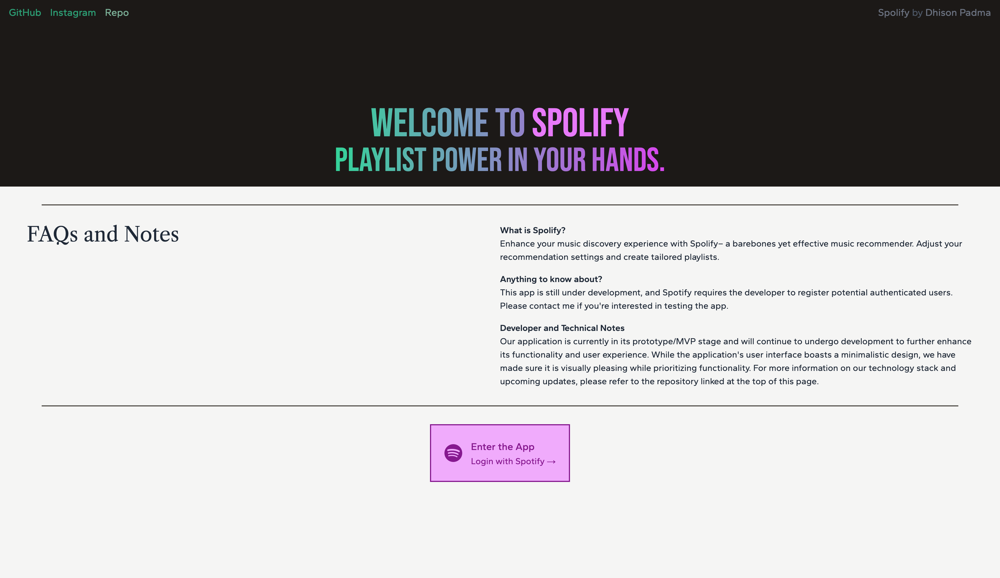
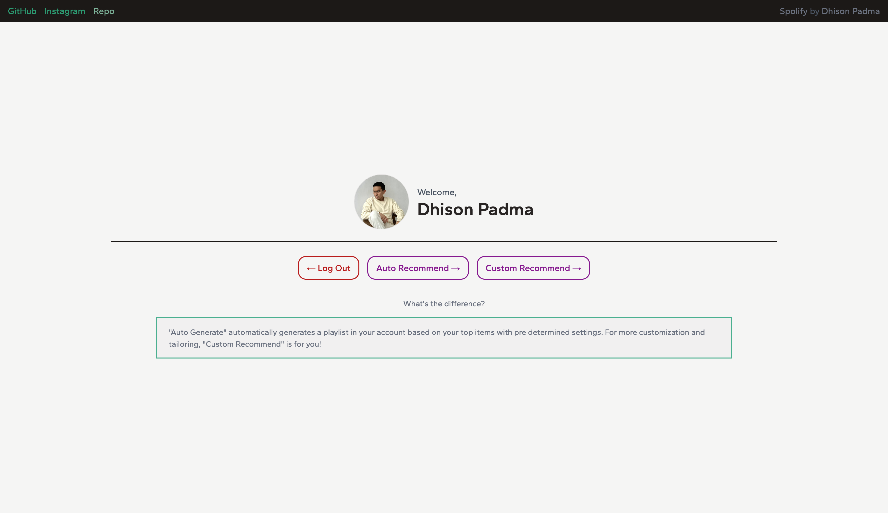
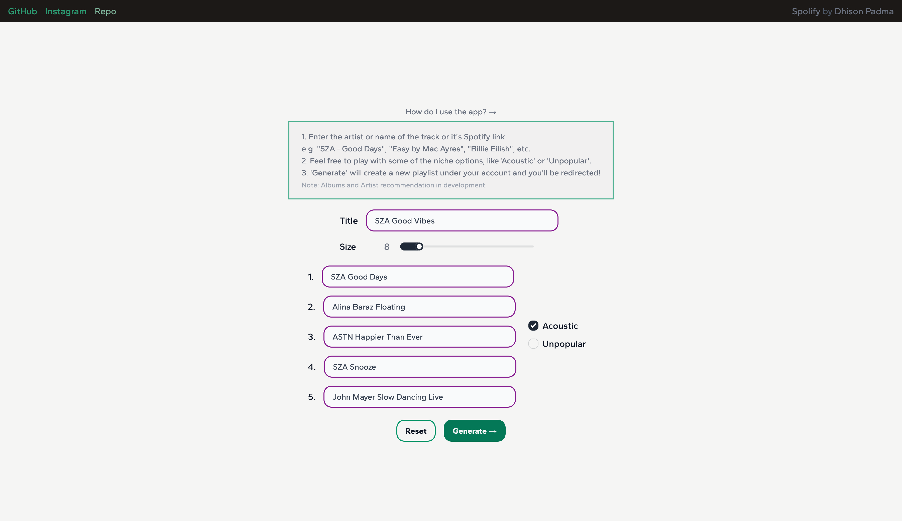
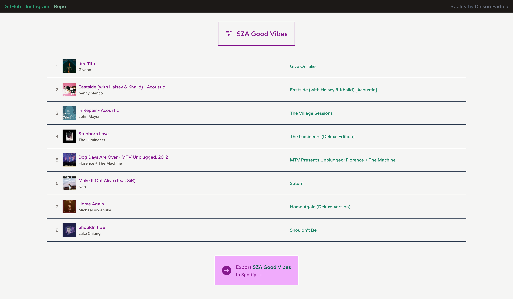

# Reclify - Playlist Generator and Song Recommender

### What is Reclify?

Enhance your music discovery experience with Reclify a barebones yet effective music recommender. Adjust your recommendation settings and create tailored playlists.

### Anything to know about?

This app is still under development, and Spotify requires the developer to register potential authenticated users. Please contact me if you're interested in testing the app.

### Developer and Technical Notes

Our application is currently in its prototype/MVP stage and will continue to undergo development to further enhance its functionality and user experience. While the application's user interface boasts a minimalistic design, we have made sure it is visually pleasing while prioritizing functionality. For more information on our technology stack and upcoming updates, please refer to the repository linked at the top of this page.

## Screenshots

<i>UI/UX are not final.</i>

## Tech Stack

### Front-end:

-   <b>Next.js</b>/TypeScript
-   TailwindCSS

### Back-end

-   <b>Flask</b>/Python
-   Spotipy (Spotify API Python Wrapper)

### Deployment / DevOps

-   Docker
-   NGINX
-   Vercel
-   DigitalOcean (VPS)

## Basic Features

-   Adjust various settings like popularity, dancibility, acousticness, etc. to customize the playlist.
-   Login to automatically generate playlist based on user's top songs.
-   Input up to 5 favorite artists, albums or songs to generate a playlist.

## Developer Notes

-   Integration with Spotify Web API
-   Secure OAuth2 authentication flow
-   Efficient and lightweight backend using Flask/Python.
-   Dockerization for easy deployment and migration.
-   NGINX as a secure and lightweight web server with SSL certification.

## In Development

-   Mini player for song preview.
-   Fun Spotify analytics and statistics

## How To Run

### Flask Microservice

Flask is run under pip virtual environment (venv). To activate the venv, go to the `/server` subdirectory and run the following command:

      source .venv/bin/activate

Then, run:

      python3 app/app.py

Alternatively, you can utilize `flask run` instead. Firstly, go to /app subfolder by running `cd app`.Then,initialize the path by running:

      export FLASK_APP=app.py
      flask run --port 8080

### Next.js
You can simply run `npm run dev` after going to the /clients subdirectory.

      cd client
      npm run dev