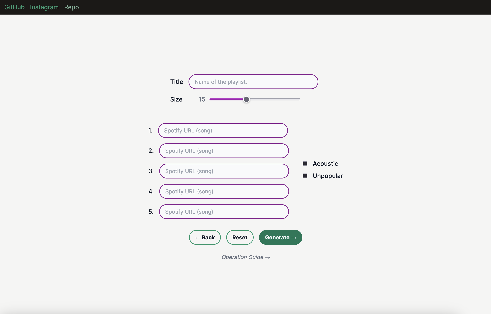
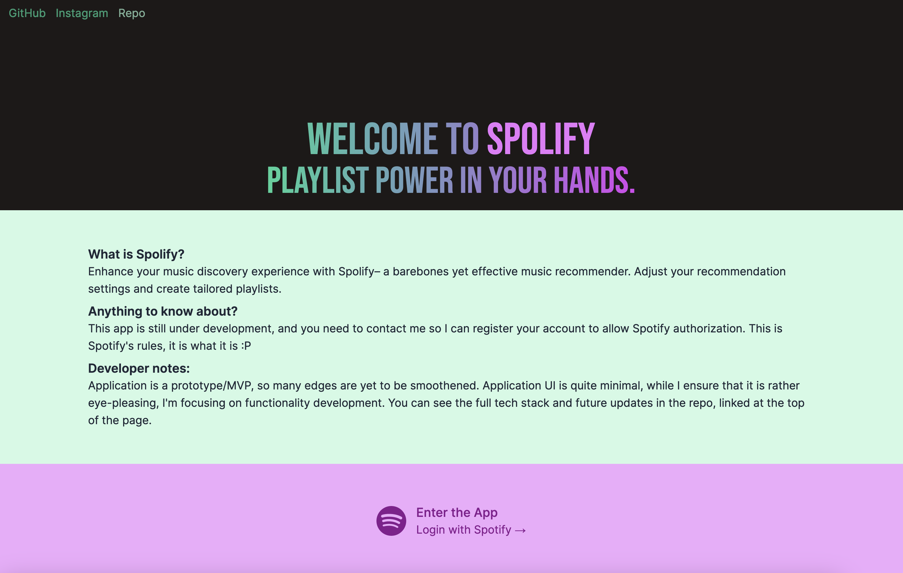

# Spolify - Playlist Generator and Song Recommender
Transform your music listening experience with Spolify - barebones yet effective music recommender. Personalize your music with adjustable settings and create tailored playlists.

Freedom and full control to your ears.
## Tech Stack
### Front-end:
- <b>Next.js</b>/TypeScript
- TailwindCSS
### Back-end
- <b>Flask</b>/Python
- Spotipy (Spotify API Python Wrapper)
### Deployment
- Docker
- Vercel for front-end
- DigitalOcean for back-end

## Basic Features
- Adjust various settings like popularity, dancibility, acousticness, etc. to customize the playlist.
- Login to automatically generate playlist based on user's top songs.
- Input up to 5 favorite <s>artists or</s> songs to generate a playlist.
- Mini-player to preview the songs.

## Developer Notes
- Integration with Spotify Web API
- Secure OAuth2 authentication flow
- Simple, lightweight backend using Flask/Python.
- Dockerized backend, deployed to Digital Ocean.

## Future Updates
- Native iOS app built on Swift and hopefully be available in the app store.
- Mini player for song preview.
- Input song/artist name into search instead of requiring link.

## Screenshots
<i>These are not final.</i> Current stage of the app is VIP.

